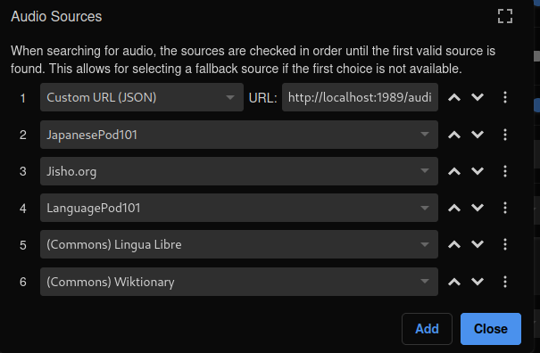

# Jips

Jips is an audio server for Japanese word pronunciations.  It is designed for
use with the [Yomitan](https://yomitan.wiki/) pop-up dictionary but also works
with other immesion learning tools, including
[Memento](https://github.com/ripose-jp/Memento).

## Features

There are other audio servers for Yomitan, so what makes Jips different?

1. Jips is easy to run
   - Just place the dictionary files and run `docker compose up`
2. Jips is simple
   - Doesn't try to run from within Anki (why?  people add their cards via ankiconnect)
   - Uses standard HTTP libaries for Python
     - Flask, Gunicorn, etc, super duper boring stuff
3. Jips performs fine
   - ~65mb ram
   - plenty of requests per second without a rewrite-in-rust
   - sets HTTP cache headers correctly so that browsers cache the audio
4. Jips is high quality
   - complete test suite
   - static analysis
   - conforms to Yomitans own json schema

## Getting up and running

### Starting Jips

1. Place dictionary files into dicts
   - for copyright reasons these are distributed [elsewhere](https://github.com/aramrw/yomichan_audio_server/releases)
2. `docker compose up`

### Configuring Yomitan

Inside Yomitan's settings, under `Audio` > `Configure audio playback sources`
add the following url as `Custom URL (JSON)`:

    `http://localhost:1989/audio.json?term={term}&reading={reading}`

Jips needs both the Kanji and the reading to unambigiously locate the
appropriate audio in dictionaries.

